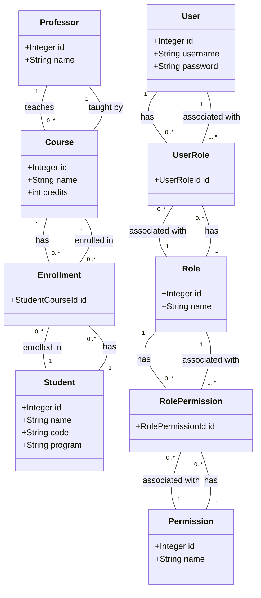

```mermaid
classDiagram
    class User {
        +Integer id
        +String username
        +String password
    }

    class Role {
        +Integer id
        +String name
    }

    class Permission {
        +Integer id
        +String name
    }

    class Professor {
        +Integer id
        +String name
    }

    class Course {
        +Integer id
        +String name
        +int credits
    }

    class Student {
        +Integer id
        +String name
        +String code
        +String program
    }

    class UserRole {
        +UserRoleId id
    }

    class RolePermission {
        +RolePermissionId id
    }

    class Enrollment {
        +StudentCourseId id
    }

    User "1" -- "0..*" UserRole : has
    Role "1" -- "0..*" UserRole : has
    UserRole "0..*" -- "1" User : associated with
    UserRole "0..*" -- "1" Role : associated with

    Role "1" -- "0..*" RolePermission : has
    Permission "1" -- "0..*" RolePermission : has
    RolePermission "0..*" -- "1" Role : associated with
    RolePermission "0..*" -- "1" Permission : associated with

    Student "1" -- "0..*" Enrollment : has
    Course "1" -- "0..*" Enrollment : has
    Enrollment "0..*" -- "1" Student : enrolled in
    Enrollment "0..*" -- "1" Course : enrolled in

    Professor "1" -- "0..*" Course : teaches
    Course "1" -- "1" Professor : taught by
```
